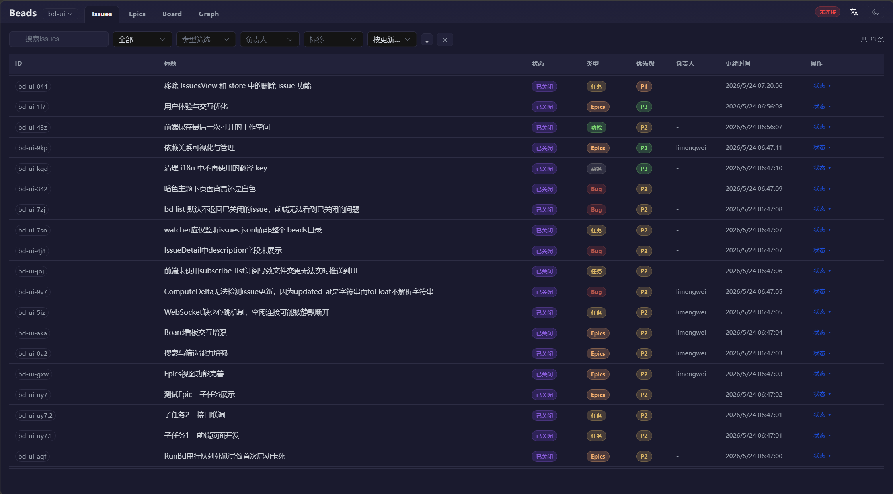
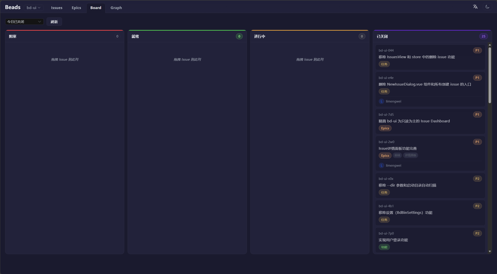
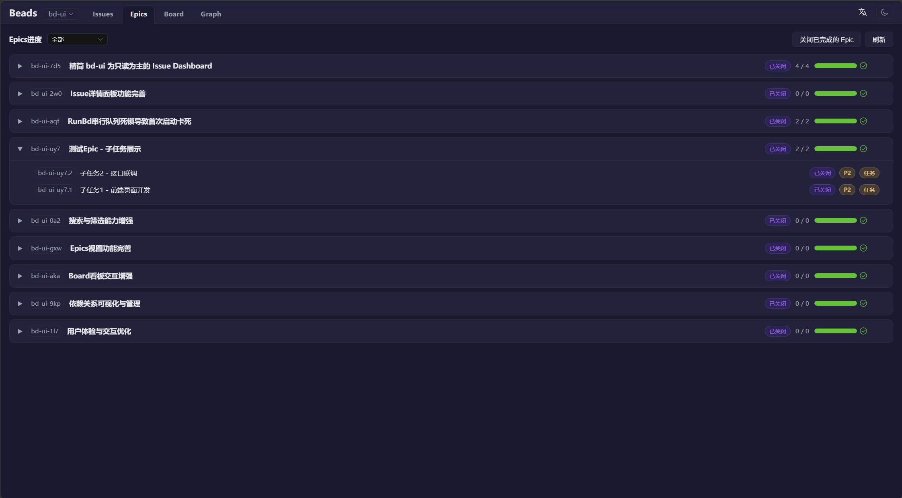
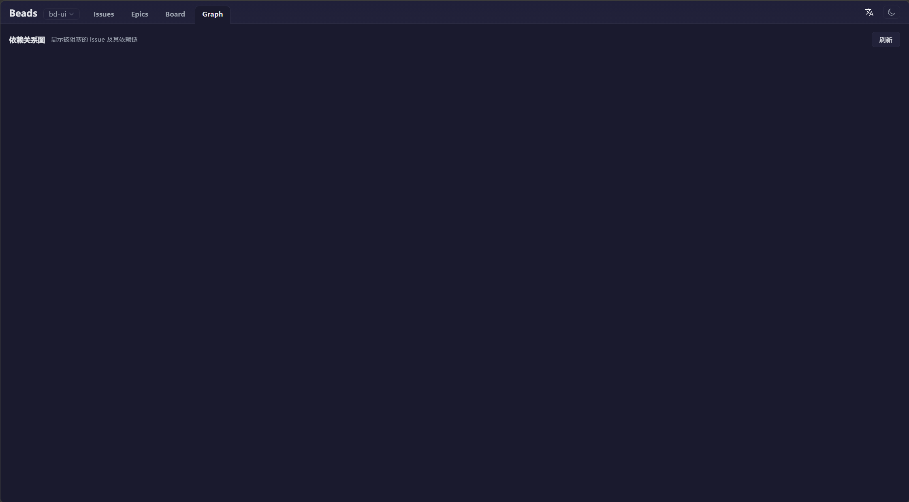

# BD-UI

English | **[中文](README.md)**

A Go implementation of the Beads UI — a local web interface for the [Beads](https://github.com/steveyegge/beads) issue tracking system.

Rewritten from the original [beads-ui](https://github.com/mantoni/beads-ui) (Node.js), with a Go backend and a Vue 3 + Element Plus frontend.

## Screenshots

<p align="center">
  
  
</p>
<p align="center">
  
  
</p>

## Features

- ✅ **Zero Config** — Run `bd-ui` and you're good to go
- 📺 **Real-time Updates** — Watches the Beads database for changes and auto-refreshes
- 🔎 **Issues View** — Filter, search, and inline edit issues
- ⛰️ **Epics View** — Track epic progress with sub-task statistics
- 🏂 **Board View** — Four-column board: Blocked / Ready / In Progress / Closed
- 🔀 **Multi-workspace** — Switch projects from a dropdown; auto-registers workspaces
- 🌐 **i18n** — Toggle between English and Chinese; integrated with Element Plus components
- 🌙 **Dark Mode** — One-click light/dark theme switch
- 📦 **Single Binary** — Frontend is embedded into the Go binary via `go:embed`; no extra files needed

## Quick Start

### Build from Source

```bash
# Build
git clone <repo-url> && cd bd-ui
cd web && npm install && npm run build && cd ..
go build -o bd-ui.exe .

# Run
bd-ui.exe
```

### Command-line Flags

| Flag | Description | Default |
|------|-------------|---------|
| `--host` | Listen address | 127.0.0.1 |
| `--port` | Listen port | 3000 |
| `--open` | Open browser on launch | false |

## Project Structure

```
bd-ui/
├── main.go                  # Entry point: CLI flags + embedded frontend + start server
├── server/
│   ├── config.go            # Configuration (host/port/rootDir)
│   ├── db.go                # Database path resolution (.beads/*.db)
│   ├── bd.go                # bd CLI invocations (serialized with mutex)
│   ├── server.go            # HTTP server + static files + API
│   ├── ws.go                # WebSocket handler (all message types)
│   ├── subscriptions.go     # Subscription registry + incremental push
│   ├── list_adapters.go     # Subscription type → bd command mapping
│   ├── watcher.go           # Database file watcher (fsnotify)
│   └── registry.go          # Workspace registry
├── web/                     # Vue 3 frontend source
│   ├── src/
│   │   ├── App.vue          # Main layout
│   │   ├── router.js        # Hash-based routing
│   │   ├── composables/
│   │   │   └── useWs.js     # WebSocket client
│   │   ├── stores/
│   │   │   ├── issues.js    # Issues state management
│   │   │   └── workspace.js # Workspace management
│   │   ├── locales/
│   │   │   ├── zh-CN.js     # Chinese language pack
│   │   │   └── en.js        # English language pack
│   │   ├── components/
│   │   │   ├── NewIssueDialog.vue
│   │   │   └── IssueDetail.vue
│   │   └── views/
│   │       ├── IssuesView.vue
│   │       ├── EpicsView.vue
│   │       └── BoardView.vue
│   └── vite.config.js
└── web-dist/                # Frontend build output (embedded via go:embed)
```

## Tech Stack

**Backend:**
- Go 1.x
- [gorilla/websocket](https://github.com/gorilla/websocket) — WebSocket communication
- [fsnotify](https://github.com/fsnotify/fsnotify) — File system watching
- `os/exec` — Invokes the `bd` CLI

**Frontend:**
- Vue 3 + Composition API
- Element Plus — UI component library
- Pinia — State management
- Vue Router — Hash-based routing
- vue-i18n — Internationalization
- Vite — Build tool

## Development

```bash
# Frontend dev (hot reload)
cd web && npm run dev         # http://localhost:5173, auto-proxies to backend

# Backend dev
go run . --port 3000

# Build for production
cd web && npm run build && cd ..
go build -o bd-ui.exe .
```

## License

MIT
